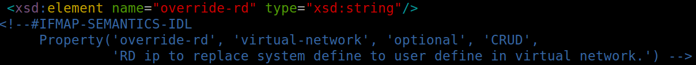
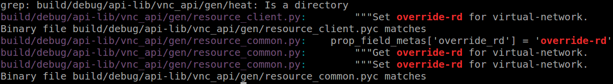
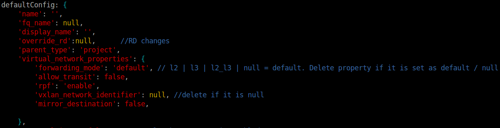
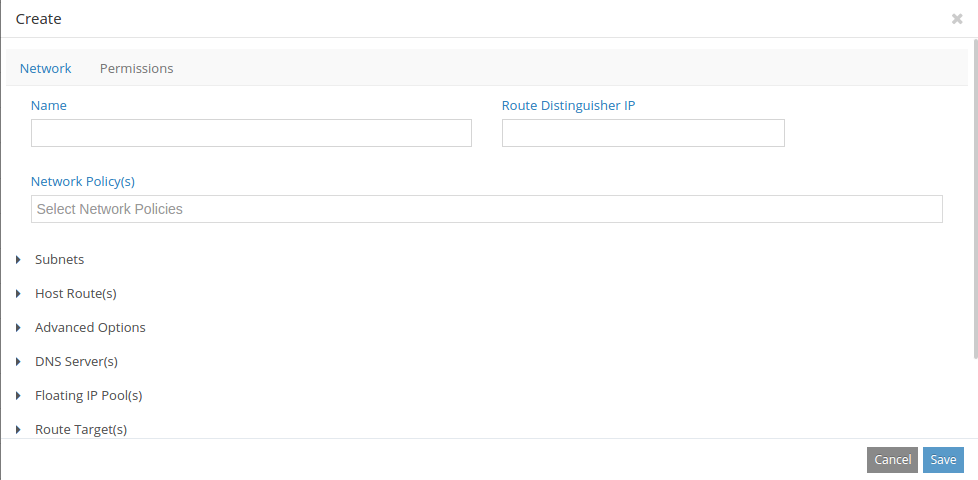

#1. Introduction

Currently RD is auto generated in contrail. This blue print implement user defined RD.

RD consists of three fields:

1) A Type field (2 bytes)
2) An Administrator field
3) An Assigned Number field

At present, three values of Type field are identified- 0, 1 and 2.

######Type 0: When Type value is 0, the Administrator field is 2-bytes and Assigned Number field is 4-bytes.
######Type 1: When Type value is 1, the Administrator field is 4-bytes and Assigned Number field is 2-bytes.
######Type 2: When Type value is 2, the Administrator field is 4-bytes and Assigned Number field is 2-bytes.

In this blue print we are targeting Type 1
We need support for user-defined RD range for customization of IP address field in Type-1 RD used by Contrail.

This blueprint provides a detailed description on defining a new Route Distinguisher field by:

1. Making changes in Contrail configuration files.
2. Making changes in Contrail GUI.

All of these steps are to be performed for the new functionality to work successfully.

#2. Problem statement
###User-defined RD range to avoid duplicates across nodes.
This feature request is related to Route Distinguisher. It concerns the Route Distinguisher field in Network. As compute host IPv4 addresses are reused across nodes, we need support for user-defined RD range which can allow for customization of IP address field in Type-1 RD used by Contrail.

#3. Proposed solution
Contrail by default exposes certain configurable options to the admin in management console which are eventually used by underlying service when making certain decisions or creating packets. In order to make RD field configurable, following set of changes are needed:

+ Expose a Route Distinguisher in Network admin UI

##3.1 Alternatives considered
Describe pros and cons of alternatives considered.

##3.2 API schema changes
 +
 +**Configuration Changes:**
 +
 ++ When used in the control node process, network derives its internal configuration from the configuration distributed by the IFMAP server.
 +
 ++ The **first step** towards defining a new knob is to add it to the schema. OpenContrail auto-generates the **REST API** that stores the configuration and makes it available through the IF-MAP server. It also generates the **API client library** that is can be used to set the configuration parameters. The network related schema is present in **controller/src/schema/vnc_cfg.xsd**.
 +
 +**Changes in vnc_cfg.xsd:**
 +
 ++ Add a new XSD element called “override-rd”. Where network elements defined.
 
 
 
 +
 ++ Execute the command **scons controller/src/api-lib**. This command builds the Python client api library that we will use later on to set the new configuration parameter. You can poke around at the generated code: **grep override-rd build/debug/api-lib/vnc_api/gen/**
 
 
 
##3.3 User workflow impact

Contrail GUI allows the user define a new route distinguisher. Route Distinguisher field define in network creation wizard, where user can provide desired  Route Distinguisher value.

##3.4 UI changes

Details in section 4.1 below.

##3.5 Notification impact

There were no changes made in logs, UVEs or alarms.

#4. Implementation
##4.1  Work items

It has 2 modules. The GUI changes are mentioned below.

###4.1.1 UI changes

These steps are to be followed to make changes in contrail GUI to reflect the impact of modifications in schema:

+ In vnCfgModel, add override_rd in defaultConfig which is present in this file: **webroot/config/networking/networks/ui/js/models/vnCfgModel.js**.

+ To add a new field on the GUI, a text field is defined in **webroot/config/networking/networks/ui/js/views/vnCfgEditView.js**

By making the above mentioned changes, the Route Distinguisher Field will become configurable in the UI.
On frontend, we get field of **Route Distinguisher IP** in the tabs **Create** and **Edit** view of network. Route Distinguisher field is also visible in the tab “Networks”.

An object is passed from frontend to API Server when we create network.

#5. Performance and scaling impact
##5.1 API and control plane

There are no changes in scalability of API and Control Plane.
##5.2 Forwarding performance
We do not expect any change to the forwarding performance.

#6. Upgrade
The RD field is a new field and hence does not have any upgrade impact.

#7. Deprecations
There are no deprecations when this change is made.

#8. Dependencies
There are no dependencies for this feature.

#9. Testing
##9.1 Unit test

GUI unit test: Check if values are visible on frontend and are passed to the backend.

##9.2 Dev test

Flow Test Steps:

+ Check if value of Route Distinguisher is received from frontend.

These tests were completed successfully.

#10. Documentation Impact
Route Distinguisher field details have to be added in user documentation.

#11. References
[RD_types](https://sites.google.com/site/amitsciscozone/home/important-tips/mpls-wiki/route-distinguisher-its-types)
